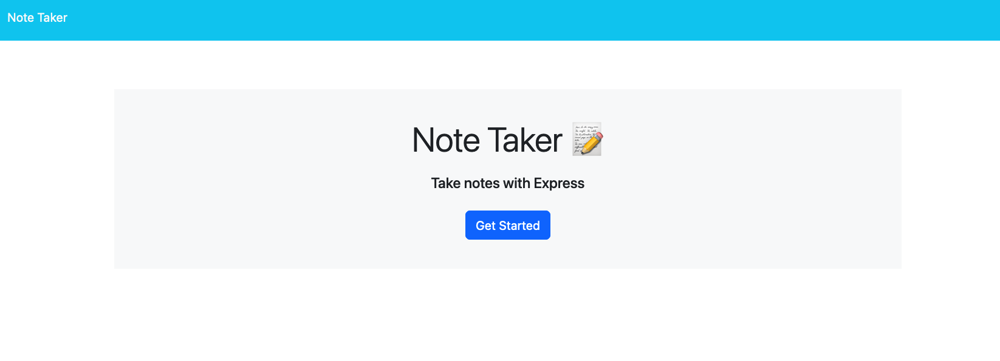
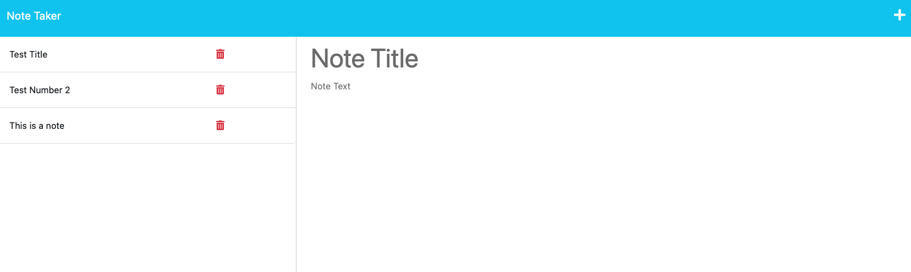

# Note Taker App

## Description:

This is an app that can help you take and keep track of them .

## Table of Contents:

- [Installation](#installation)
- [Usage](#usage)
- [License](#license)
- [Contributions](#contributions)
- [Published Page](#page)
- [Repo](#repo)

## Installation

No installation just visit published page

## Usage

Once on the main page you can click start taking notes and it'll take you to the note taking area. You can give your notes unique titles and then add the text you would like , once completed hit the save button and it will be saved along with the other notes. If you need to remove a note just hit the trash can icon. If you want to read the note back just click on the title of the note.

## License

## Contributions

N/A

## Screen Shot

# LINKS

## Page

https://serene-plains-38188.herokuapp.com/

## Repo

https://github.com/Zcordeiro/Note-Taker
